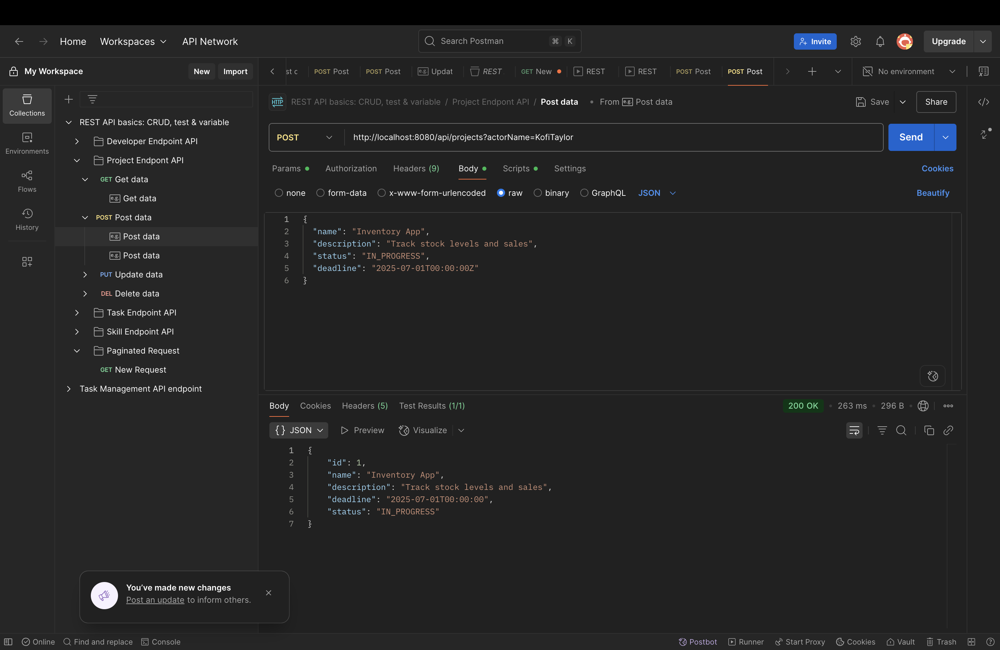
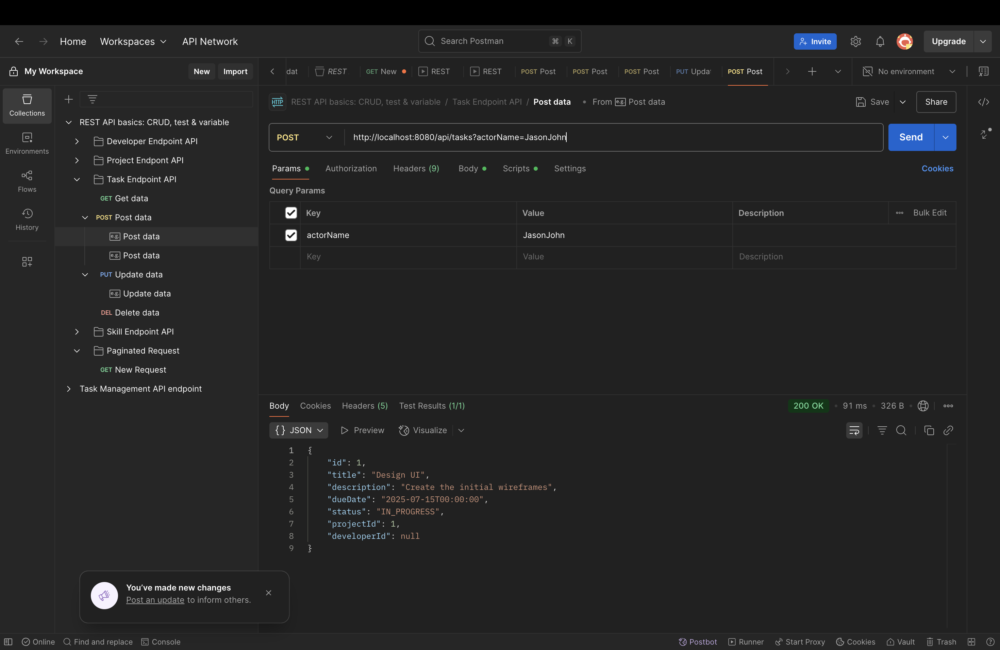
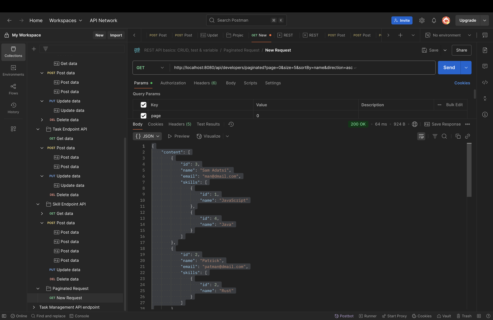
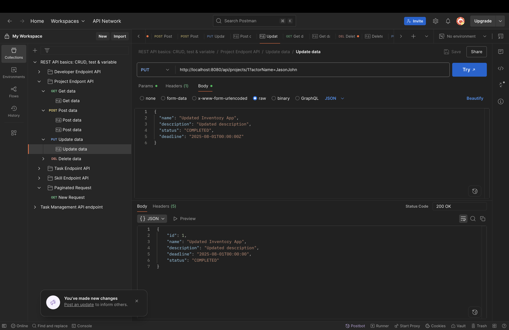
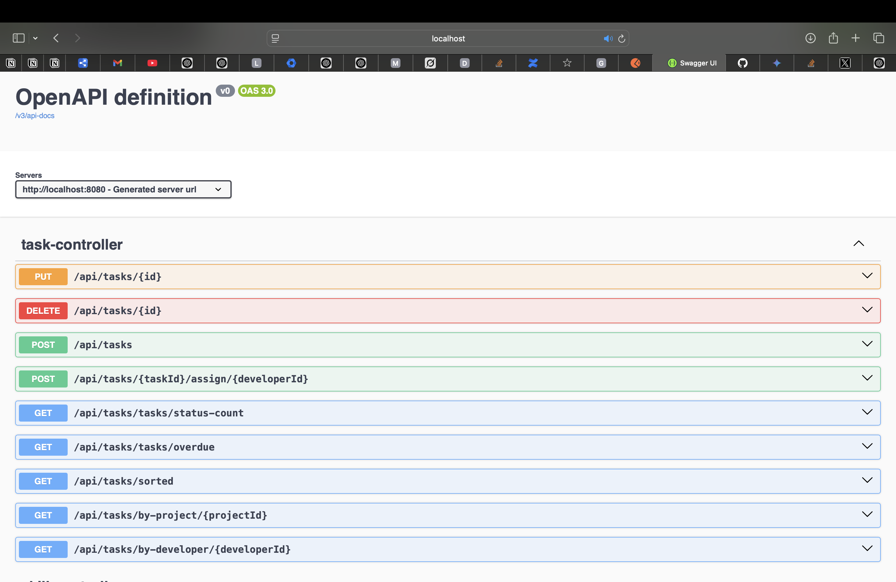

# 📌 Project Tracker API

A robust task and project management API built with Spring Boot, PostgreSQL, and MongoDB, featuring caching, audit logging, and Swagger documentation.

## 🧰 Tech Stack
- **Backend**: Java 17+, Spring Boot 3.x
- **Databases**:
  - PostgreSQL (Primary data)
  - MongoDB (Audit logs)
- **Features**:
  - Spring Data JPA + MongoTemplate
  - Spring Cache (Simple)
  - Swagger UI
  - Docker Compose deployment

## 🚀 Getting Started

### Prerequisites
- Docker 20.10+
- Docker Compose 2.0+

### 🐳 Docker Setup
1. Create `docker-compose.yml`:
```yaml
version: '3.8'

services:
  postgres:
    image: postgres:16
    environment:
      POSTGRES_PASSWORD: mysecretpassword
      POSTGRES_DB: projecttracker
    ports: ["5432:5432"]
    volumes: [postgres-data:/var/lib/postgresql/data]

  mongo:
    image: mongo:6
    ports: ["27017:27017"]
    volumes: [mongo-data:/data/db]

  app:
    build: .
    depends_on: [postgres, mongo]
    ports: ["8080:8080"]
    environment:
      SPRING_DATASOURCE_URL: jdbc:postgresql://postgres:5432/projecttracker
      SPRING_DATASOURCE_PASSWORD: mysecretpassword
      SPRING_DATA_MONGODB_URI: mongodb://mongo:27017/mydb

volumes:
  postgres-data:
  mongo-data:
```

2. Start services:
```bash
docker-compose up --build
```

### ⚙️ Configuration
Example `application.yml`:
```yaml
spring:
  datasource:
    url: jdbc:postgresql://localhost:5432/projecttracker
    username: postgres
    password: mysecretpassword
  data:
    mongodb:
      uri: mongodb://localhost:27017/mydb
  cache:
    type: simple
```

## 🌐 API Endpoints

### 📂 Projects
| Method | Endpoint                     | Description                    |
|--------|------------------------------|--------------------------------|
| POST   | `/api/projects`              | Create project                 |
| GET    | `/api/projects`              | List all projects              |
| GET    | `/api/projects/{id}`         | Get project (cached)           |
| PUT    | `/api/projects/{id}`         | Update project                 |
| DELETE | `/api/projects/{id}`         | Delete project                 |
| GET    | `/api/projects/without-tasks`| List projects without tasks    |

### ✅ Tasks
| Method | Endpoint                           | Description                          |
|--------|------------------------------------|--------------------------------------|
| POST   | `/api/tasks`                       | Create task                          |
| GET    | `/api/tasks/{id}`                  | Get task by ID                       |
| PUT    | `/api/tasks/{id}`                  | Update task                          |
| DELETE | `/api/tasks/{id}`                  | Delete task                          |
| GET    | `/api/tasks/byproject/{id}`        | Get tasks by project ID              |
| GET    | `/api/tasks/bydeveloper/{developerId}` | Get tasks by developer ID         |
| POST   | `/api/tasks/{taskId}/assign/{developerId}` | Assign task to developer       |
| GET    | `/api/tasks/overdue`               | Get overdue tasks (cached)           |
| GET    | `/api/tasks/status-count`          | Task counts by status                |
| GET    | `/api/tasks/sorted`                | Get sorted tasks (?sortBy=dueDate&direction=asc) |

### 👨‍💻 Developers
| Method | Endpoint                           | Description                          |
|--------|------------------------------------|--------------------------------------|
| POST   | `/api/developers`                  | Add developer                        |
| GET    | `/api/developers`                  | List all developers                  |
| PUT    | `/api/developers/{id}`             | Update developer                     |
| DELETE | `/api/developers/{id}`             | Delete developer                     |
| PUT    | `/api/developers/{developerId}/skills` | Update developer skills           |
| GET    | `/api/developers/developers/top`   | Get top 5 developers by task count   |
| GET    | `/api/developers/paginated`        | Get paginated developers (?page=0&size=10&sortBy=id&direction=asc) |

### 🛠 Skills
| Method | Endpoint                                    | Description                          |
|--------|---------------------------------------------|--------------------------------------|
| POST   | `/api/skills`                              | Create skill                         |
| GET    | `/api/skills`                              | List all skills                      |
| GET    | `/api/skills/{id}`                         | Get skill by ID                      |
| PUT    | `/api/skills/{id}`                         | Update skill                         |
| DELETE | `/api/skills/{id}`                         | Delete skill                         |
| POST   | `/api/skills/{skillId}/developers/{developerId}` | Add skill to developer           |
| DELETE | `/api/skills/{skillId}/developers/{developerId}` | Remove skill from developer      |

### 📝 Audit Logs
| Method | Endpoint                     | Description                          |
|--------|------------------------------|--------------------------------------|
| GET    | `/logs`                      | Get logs (?entityType=Task&actorName=Patrick) |

## 🔄 Caching
- **Cached**: Project/task details, sorted lists
- **Evicted**: On data modifications

## 📊 Swagger UI
Access at: [http://localhost:8080/swagger-ui/index.html#/skill-controller](http://localhost:8080/swagger-ui/index.html)

## 🖼️ Sample Requests

### Create Project
```json
POST /api/projects
{
  "name": "API Redesign",
  "description": "Modernize legacy APIs"
}
```

## 📸 Sample Request/Response

### Create Project – POST /api/projects?actorName=KofiTaylor
📷 

### Create Task – POST /api/tasks?actorName=KofiTaylor
📷 

### Get Developer Paginated – GET /api/developers/paginated?page=0&size=5&sortBy=name&direction=asc
📷 

### Update Task – PUT /api/tasks/1?actorName=KofiTaylor
📷

### Swagger UI
📷 📷

## ✨ Features
- Transactional operations
- Pagination (`?page=0&size=5`)
- Sorting (`?sort=dueDate,asc`)
- MongoDB audit trails

## 🛠 Development
```bash
mvn spring-boot:run  # For local development
```

# 🔐 Spring Security — Username/Pass + JWT + Google OAuth 2.0

## 🟣 Introduction

This application demonstrates **Spring Security** with:

✅ **Username/Pass + JWT authentication**
✅ **Google OAuth 2.0 login**
✅ **Custom Security Filter and Success Handler**
✅ **Postgres and Mongo (optional) for persistence and logging**

---

## 🟣 Architectural Flow

### 1️⃣ Username/Pass:

- User performs **POST /login** with credentials.
- `UsernameAndPassAuthFilter` validates credentials against `UserDetailsService`.
- If authentication is successful, a **JWT** is generated and returned in the `Authorization` header.

---

### 2️⃣ Subsequent API Access:

- The **JwtAuthFilter** parses `Authorization:Bearer <TOKEN>` from requests.
- It validates the JWT and populates `SecurityContext`.
- Access is then allowed to secured endpoints.

---

### 3️⃣ Google OAuth 2.0:

- User initiates **GET /oauth2/authorization/google**
- User is redirected to Google to approve.
- After approval, Google calls back to **/login/oauth2/code/{registrationId}**
- Spring parses this, converts it to a `OAuth2User`.
- The **CustomOAuth2SuccessHandler** emits a JWT for this user.
- User is then redirected back to frontend with `?token=<generated_jwt>`.

---

## 🔹 Summary of Filters

| Filter | Action |
|---------|---------|
| `UsernameAndPassAuthFilter` | Authenticates credentials and emits JWT |
| `JwtAuthFilter` | Validates JWT for subsequent requests |
| `CustomOAuth2SuccessHandler` | Initializes or finds a User from Google, then emits a JWT |  

---

## 🔹 Security Flow Diagram (Simplified)

---

## 🔹 Tech Stack

- **Spring Security 6**
- **Spring Boot 3**
- **Username/Pass + JWT with custom filters**
- **OAuth 2.0 Client (Login with Google)**
- **Custom Success Handler to generate JWT upon Google authentication**
- **Postgres (Primary datastore)**
- **MongoDB (Audit Logs)**

---

## 🔹 Summary

✅ Username/Pass + JWT flow:
POST credentials → validate → generate JWT → subsequent requests with `Authorization:Bearer <TOKEN>`

✅ Google OAuth 2.0 flow:
Login with Google → Google parses credentials → Spring converts to `OAuth2User` → emits JWT → User redirected back with `?token=<generated_jwt>`

---

🚀Tip:
Make sure to **keep your JWT secret key safely configured** and **set proper expiration and validation criteria** to avoid unauthorized access.

---

## 🔹 Additional Notes

➥ The custom `UsernameAndPassAuthFilter` is configured to handle credentials submission at **POST /login**.

➥ The `CustomOAuth2SuccessHandler` converts Google authentication into a JWT and performs a **redirect with the JWT attached in the URL**.

➥ The `JwtAuthFilter` parses this JWT for subsequent requests and populates the `SecurityContext`.

---

**Note**: Requires Java 17+ and Maven/Gradle.