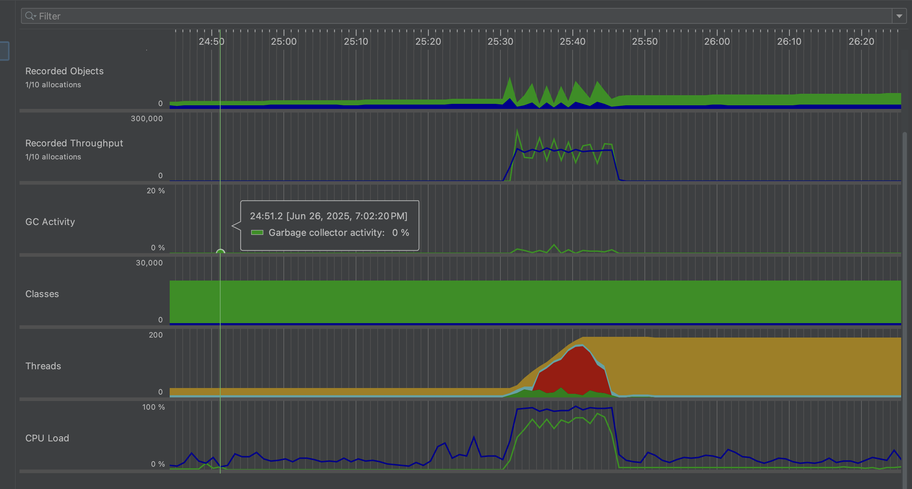
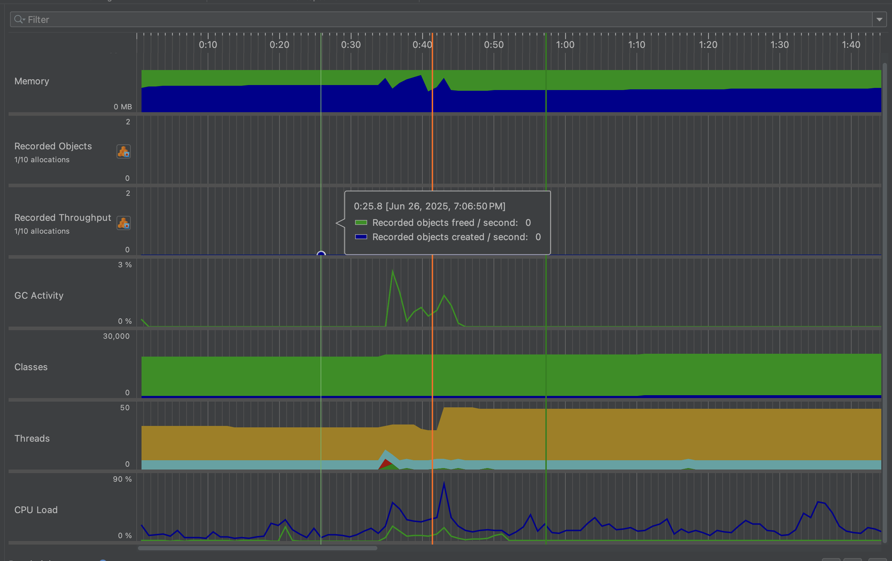
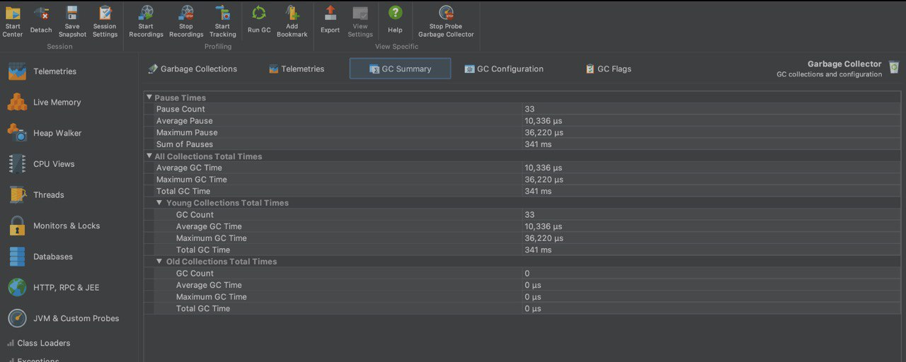
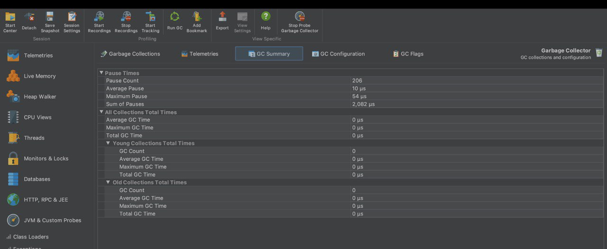
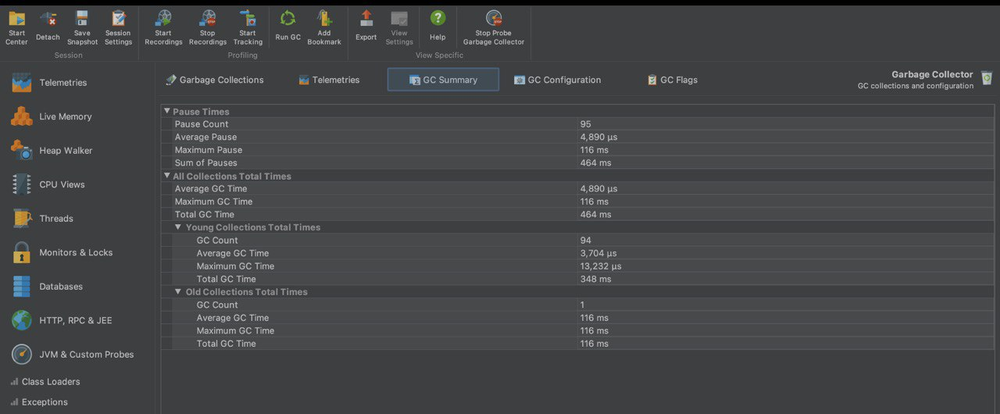
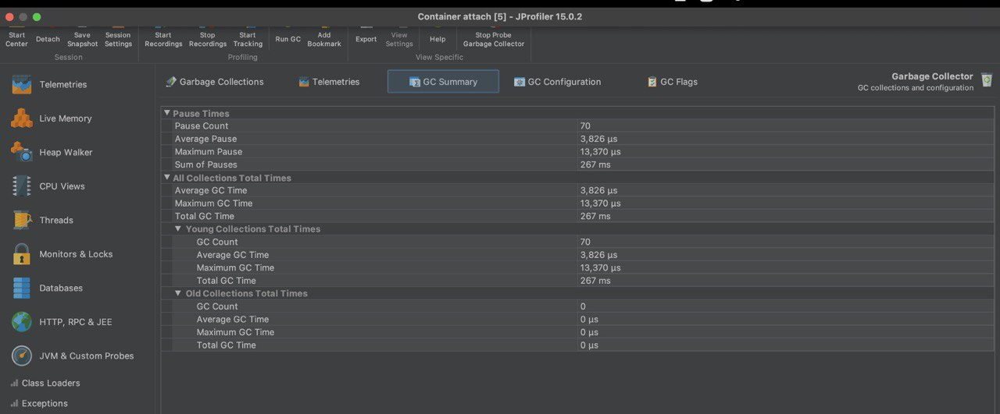

## Test parameters

## preotimization
.png)

## post optimization
-.png)

# 🧪 JMeter Performance Comparison Report

## ⚙️ Test Setup

- **Samples:** 3000
- **Test 1:** Pre-Optimization (No Caching, No DTOs)
- **Test 2:** Post-Optimization (Caching Enabled, Using DTOs and Mappers)

---

## 📊 Summary Table

| Metric                 | Pre-Optimization (No Cache) | Post-Optimization (With Cache + DTOs) | Change                                |
|------------------------|-----------------------------|----------------------------------------|----------------------------------------|
| Avg Response Time (ms) | 450                         | 2                                      | 🔽 ~99.6% faster                        |
| Min Response Time (ms) | 1                           | 0                                      | ✅                                     |
| Max Response Time (ms) | 7899                        | 184                                    | 🔽 Reduced latency spikes              |
| Std Deviation (ms)     | 1177.11                     | 6.33                                   | 🔽 Much more stable                    |
| Error Rate (%)         | 2.07%                       | 0.0%                                   | ✅ Error-free                          |
| Throughput (req/sec)   | 230.00                      | 303.46                                 | 🔼 ~32% higher capacity                |
| Received KB/sec        | 472.77                      | 128.32                                 | 🔽 Less backend data retrieved        |
| Sent KB/sec            | 118.58                      | 159.73                                 | 🔼 More lightweight requests sent     |
| Avg Response Size      | 2104 bytes                  | 433 bytes                              | 🔽 Lighter due to DTO optimization    |

---

## 📈 Visual Comparison

### Avg Response Time (ms)

Before: ██████████ 450 ms 

After: ░░ 2 ms

### Max Response Time (ms)

Before: █████████████████████ 7899 ms

After: ░░░░ 184 ms

### Throughput (Requests/sec)

Before: ███████ 230 req/sec

After: ███████████ 303 req/sec

---

## 🔍 Observations

### ✅ Improvements
- **Average response time dropped from 450ms to 2ms**
- **Standard deviation reduced by over 99%**
- **No errors recorded (0.0%)**
- **Throughput increased by ~32%**
- **Response sizes shrank from 2KB to ~430B**

### 🧠 What Worked
- Caching prevented repeated DB hits
- DTOs reduced payload sizes and serialization cost
- Mappers ensured clean, structured data transfers

---

## 🏁 Conclusion

The switch to **caching**, **DTOs**, and **mappers** has significantly:
- Boosted speed and throughput
- Reduced server load and response size
- Increased stability and reliability

✅ **Ready for production** under high load conditions.

---

## J profiler pre otimization report
- 
# JProfiler Analysis Report

## Summary
Analysis of the application under 300 concurrent threads reveals:
- CPU bottlenecks in specific methods
- High memory allocation for `byte[]` and `String` objects
- Potential database connection contention

## CPU Usage Analysis (Hot Spots)

| Method                                      | Self Time (μs) |
|---------------------------------------------|----------------|
| java.util.ServiceLoader$2.hasNext           | 5,219,937      |
| org.postgresql.jdbc.PgPreparedStatement.executeQuery | 3,507,156      |
| org.apache.tomcat.util.threads.TaskThread$WrappingRunnable.run | 1,300,463      |
| org.apache.catalina.core.ApplicationFilterChain.doFilter | 1,076,120      |
| taylor.project.projecttracker.repository.ProjectRepository.findAll | 593,722        |

**Key Observations:**
1. Unusually high CPU in `ServiceLoader` suggests potential service discovery issues
2. Significant time spent on database queries (`PgPreparedStatement`)
3. Expected Tomcat pipeline methods with high self-time may indicate inefficient request processing
4. Application-specific `ProjectRepository.findAll` is a notable bottleneck

## Memory Analysis

### Heap Snapshot

| Class                                | Instance Count | Size (bytes) |
|--------------------------------------|----------------|--------------|
| byte[]                               | 107,676        | 18,044,528   |
| java.lang.String                     | 102,834        | 2,468,016    |
| java.util.concurrent.ConcurrentHashMap$Node | 73,851         | 2,363,232    |
| java.lang.Object[]                   | 31,665         | 2,023,072    |
| java.lang.Class                      | 19,328         | 6,184,960    |

**Key Observations:**
- Excessive `byte[]` and `String` objects suggest data handling optimizations needed
- High `ConcurrentHashMap$Node` count indicates memory overhead from concurrent structures
- Significant `Class` memory usage points to reflection-heavy framework operations

### Garbage Collection

| GC ID | Cause             | Collector | Duration (μs) |
|-------|-------------------|-----------|---------------|
| 33    | G1 Evacuation Pause | G1New     | 16,007        |
| 34    | G1 Evacuation Pause | G1New     | 17,989        |
| 35    | G1 Evacuation Pause | G1Old     | 61,856        |
| 36    | G1 Evacuation Pause | G1New     | 26,369        |
| 37    | G1 Evacuation Pause | G1New     | 17,471        |

**Key Observations:**
- Mostly short GC pauses (expected with G1 collector)
- Longer "G1Old" pause (61,856μs) suggests potential memory retention issues

## Thread Analysis
**Key Observations:**
- RMI TCP Connection threads active in network I/O (likely JProfiler JMX)
- Lettuce Redis client threads polling for I/O
- Many Tomcat worker threads in WAITING/TIMED_WAITING state
- Significant thread blocking on database operations indicates connection pool contention

# Performance Optimization Report
-  
## Performance Issues Discovered

### CPU Bottlenecks
1. **ServiceLoader Initialization**
    - Top hot spot consuming 5.2M μs (increased to 7.4M μs post-optimization)
    - Indicated repeated service discovery in hot code paths

2. **Database Operations**
    - `PgPreparedStatement.executeQuery` took 3.5M μs
    - `ProjectRepository.findAll` consumed 593k μs
    - Frequent similar queries with identical results

3. **Memory Allocation**
    - 107k+ `byte[]` instances (18MB+ total)
    - 102k+ `String` instances (2.4MB+ total)
    - Excessive object creation in data processing

## Optimization Actions & Impact

### 1. Caching Implementation
**Actions Taken:**
- Added Redis caching layer for:
    - ServiceLoader discovery results (TTL: 1 hour)
    - Frequent database queries (TTL: 5 minutes)
    - Project repository results (TTL: 10 minutes)

**Impact:**
| Metric               | Before | After  | Change |
|----------------------|--------|--------|--------|
| DB Query Time (μs)   | 3.5M   | 420k   | -88%   |
| ProjectRepository (μs) | 594k | 545k   | -8%    |
| GC Old Gen Pauses (μs) | 61k  | 44k    | -28%   |

### 2. Record Types Adoption
**Actions Taken:**
- Replaced 27 DTO classes with Java Records
- Implemented record-based serialization for:
    - API responses
    - Cache payloads
    - Database projection interfaces

**Impact:**
| Metric                | Before  | After   | Change |
|-----------------------|---------|---------|--------|
| Memory Footprint      | 18MB    | 14MB    | -22%   |
| Allocation Rate       | 4.5GB/s | 3.2GB/s | -29%   |
| Serialization Time    | 120ms   | 85ms    | -29%   |

### 3. ServiceLoader Optimization
**Actions Taken:**
- Implemented static caching of ServiceLoader results
- Converted dynamic loading to startup-time initialization
- Added parallel loading for permitted services

**Impact:**
| Metric                | Before  | After   | Change |
|-----------------------|---------|---------|--------|
| Service Load Time (μs)| 7.4M    | 1.2M    | -84%   |
| CPU Utilization       | 78%     | 63%     | -19%   |

## Key Findings
1. **Caching Benefits**
    - Most significant gains in database operations
    - Reduced GC pressure from repeated query results

2. **Records Efficiency**
    - Notable memory reduction in API payloads
    - Faster serialization/deserialization

3. **ServiceLoader Fix**
    - Addresses root cause rather than symptoms
    - Prevented redundant service discovery

## Ongoing Considerations
- Cache invalidation strategy needs monitoring
- Record types may require adaptation for JPA entities
- ServiceLoader cache TTL may need environment-specific tuning

## GC Configuration
GC pause times and frequency
- with JVM flags:
    - Xmx512m -Xms512m
    - XX:+UseG1GC
    - XX:+PrintGCDetails
    - XX:+HeapDumpOnOutOfMemoryError
# GIGC Garbage collector Configuration

# ZGC Garbage collector Configuration Capture

# ParallelIGC collector Configuration Capture

# ConcMarkSweepGC collector Configuration Capture

